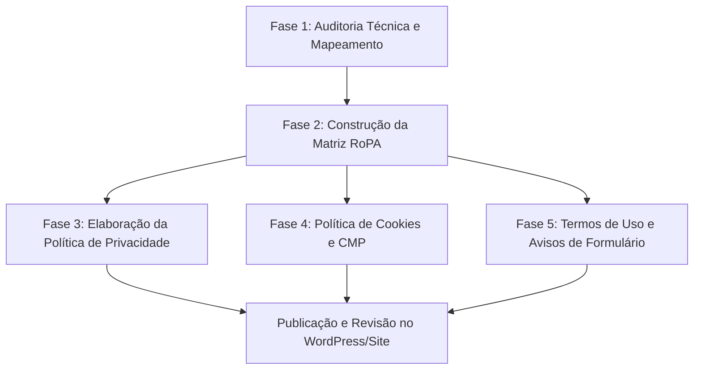

# LGPD: Mapeamento de Site e Elaboração de Políticas

Esta skill é a camada **técnico-operacional** complementar à skill `lgpd-brasil` (que provê a fundamentação jurídica e legal da Lei 13.709/2018). Enquanto a `lgpd-brasil` orienta sobre as regras da lei, esta skill orienta sobre **como auditar o código do site, levantar o inventário de dados (RoPA) e redigir/atualizar as políticas públicas e avisos de consentimento**.

---

## Quando Utilizar Esta Skill

Ative esta skill quando você ou o usuário precisarem:
1. **Auditar e Mapear Dados Pessoais do Site (Data Discovery):**
   - Rastrear formulários de captura, orçamentos, newsletter, vagas/currículos e comentários.
   - Auditar cookies, scripts de rastreamento (GTM, GA4, Meta Pixel) e banners de consentimento (ex.: AdOpt CMP).
   - Inspecionar dados armazenados no navegador (`localStorage`, `sessionStorage`, cookies PHP) e bancos de dados.
2. **Construir o Inventário de Dados (RoPA - Record of Processing Activities):**
   - Mapear cada fluxo de dados com sua respectiva base legal (Art. 7º ou 11 da LGPD), finalidade, retenção e operadores envolvidos.
3. **Redigir e Atualizar as Políticas Legais do Site:**
   - Elaborar ou atualizar a **Política de Privacidade** (conforme os Guias Orientativos da ANPD).
   - Elaborar ou atualizar a **Política de Cookies** (com tabela categorizada e instruções de opt-out/gestão de preferências).
   - Elaborar ou atualizar os **Termos de Uso do Website** (especialmente para sites com catálogo de produtos, orçamentos B2B ou e-commerce).
   - Redigir **Avisos de Privacidade Pontuais (Just-in-Time Notices)** nos formulários do site.
4. **Publicar/Atualizar Páginas Legais no WordPress:**
   - Aplicar o conteúdo nas páginas correspondentes (ex.: página de Política de Privacidade existente, blocos Kadence ou via WP-CLI).

---

## Relação com a Skill `lgpd-brasil`

Sempre trabalhe em sinergia com a skill `lgpd-brasil`:
- **`lgpd-brasil` (O Direito):** Define os princípios (Art. 6º), as 10 bases legais para dados pessoais (Art. 7º), as hipóteses para dados sensíveis (Art. 11), os requisitos do consentimento (Art. 8º) e os direitos do titular (Art. 18).
- **`lgpd-site-mapping-and-policies` (A Operação):** Varre o código, identifica os campos dos formulários e tecnologias ativas, cruza cada campo com a base legal apropriada da LGPD e produz os textos claros, transparentes e acessíveis que vão para o ar.

---

## Fluxo de Trabalho em 5 Fases

---

## Fase 1: Auditoria Técnica de Dados no Site (Data Discovery)

Antes de escrever qualquer política, faça a varredura real do código da aplicação:

### 1.1 Mapeamento de Formulários e Pontos de Entrada
Examine os arquivos onde existem formulários (`<form>` ou chamadas AJAX). No ambiente WordPress/Uônix, verifique:
- **Formulários de Lead / Contato:** (`mu-plugins/uonix-forms/` ou similares)
  - Quais campos são solicitados? (Nome, E-mail, Telefone/WhatsApp, Empresa, Mensagem).
  - Há validação de campos obrigatórios vs opcionais? (Princípio da Minimização / Necessidade).
- **Formulário de Trabalhe Conosco / Vagas:**
  - Há envio de currículos? (Pode conter dados sensíveis, endereço, histórico profissional).
  - Como esses arquivos são armazenados e por quanto tempo ficam guardados?
- **Formulários de Orçamento / Checkout (WooCommerce):**
  - Dados de faturamento (Nome, CNPJ/CPF, Razão Social, E-mail, Telefone, Endereço de entrega).
- **Comentários do Blog:**
  - Nome, E-mail, Site, IP do comentarista, cookies de memorização.
- **Newsletter:**
  - Apenas e-mail ou nome e e-mail?

### 1.2 Mapeamento de Rastreamento, Tags e Terceiros
Inspecione scripts carregados no `<head>` e `<body>` (ex.: `38-integracoes-analytics-lgpd.php`):
- **Gerenciador de Tags:** Google Tag Manager (GTM).
- **Analytics & Métricas:** Google Analytics 4 (GA4), Clarity, Hotjar, etc.
- **Pixels de Conversão:** Meta Pixel (Facebook), Google Ads, LinkedIn Insight Tag.
- **Segurança & Anti-Spam:** Cloudflare Turnstile, Google reCAPTCHA.
- **Gerenciador de Consentimento (CMP):** Banner AdOpt, Cookiebot, OneTrust ou solução própria.
- **Serviços de E-mail / CRM:** RD Station, Mailchimp, ActiveCampaign, Mailpit/SMTP externo.

### 1.3 Mapeamento de Armazenamento Local (Client-Side)
Verifique scripts que utilizam:
- `localStorage` ou `sessionStorage` (ex.: memorização de dados de lead para autopreenchimento cross-form).
- Cookies First-Party criados por JavaScript ou PHP.
- Regra de Ouro da LGPD: A persistência de dados no navegador do visitante deve respeitar a escolha feita no banner de consentimento (se rejeitou, limpar o storage).

---

## Fase 2: Matriz RoPA (Registro das Operações de Tratamento)

Consolide os dados levantados em uma matriz estruturada antes de redigir os textos. Utilize o template em `templates/ropa-inventario-dados-template.md`.

Cada operação deve conter:
1. **Canal / Ponto de Coleta:** (ex.: Formulário de Orçamento / WooCommerce).
2. **Dados Coletados:** (ex.: Nome, E-mail, Telefone, Empresa, Cidade/UF).
3. **Categoria de Titular:** (ex.: Cliente B2B, Prospect, Candidato a Vaga, Visitante).
4. **Finalidade Específica:** (ex.: Emissão de proposta comercial e contato técnico).
5. **Base Legal da LGPD (Art. 7º):**
   - Contato comercial / Orçamento: *Execução de procedimentos preliminares a pedido do titular* (Art. 7º, V) ou *Legítimo Interesse* (Art. 7º, IX).
   - Newsletter: *Consentimento* (Art. 7º, I).
   - Faturamento / Nota Fiscal: *Cumprimento de obrigação legal ou regulatória* (Art. 7º, II) e *Execução de contrato* (Art. 7º, V).
   - Segurança do site (IP/Logs): *Legítimo Interesse* (Art. 7º, IX) e *Prevenção à Fraude* (Art. 7º e 11).
   - Cookies de marketing: *Consentimento* (Art. 7º, I).
6. **Tempo de Retenção:** Prazo de descarte ou justificativa para guarda.
7. **Compartilhamento / Operadores:** Quem tem acesso (hospedagem, provedor de e-mail, gateway de pagamento, consultores).

---

## Fase 3: Elaboração da Política de Privacidade

A Política de Privacidade deve ser clara, acessível (linguagem simples, sem juridiquês excessivo) e conter rigorosamente os itens exigidos pela ANPD e Art. 9º da LGPD.

### Estrutura Obrigatória da Política:
1. **Apresentação e Identificação do Controlador:**
   - Razão Social completa, CNPJ, endereço da sede, ramo de atuação e compromisso com a privacidade.
2. **Identificação do Encarregado de Dados (DPO):**
   - Nome (ou indicação da equipe responsável) e canal oficial de contato exclusivo para privacidade (ex.: `privacidade@uonix.com.br` ou formulário específico).
3. **Quais Dados Coletamos e Por Quais Canais:**
   - Apresentação organizada (preferencialmente em tabela ou tópicos bem divididos por finalidade).
4. **Finalidades e Bases Legais Aplicadas:**
   - Explicação transparente de por que cada dado é coletado e com qual respaldo da LGPD.
5. **Compartilhamento de Dados com Terceiros (Operadores):**
   - Categorias de parceiros: infraestrutura de hospedagem em nuvem, ferramentas de análise, plataformas de envio de e-mail, consultorias técnicas.
   - Menção de que **não há venda nem comercialização** de dados pessoais.
6. **Transferência Internacional de Dados:**
   - Identificação se serviços em nuvem (ex.: servidores AWS, Google Cloud, GitHub, AdOpt) realizam trânsito internacional e garantia de mecanismos contratuais adequados.
7. **Segurança da Informação e Armazenamento:**
   - Medidas técnicas: HTTPS/TLS, controle de acessos restritos, criptografia, backups, auditoria de logs.
8. **Tempo de Retenção e Descarte (Arts. 15 e 16):**
   - Critérios de retenção durante a relação comercial e prazos legais (ex.: Marco Civil da Internet para logs, Código Tributário/Civil para notas fiscais e orçamentos).
9. **Direitos do Titular de Dados (Art. 18 da LGPD):**
   - Listar claramente: Confirmação e Acesso, Correção, Anonimização/Bloqueio/Eliminação, Portabilidade, Revogação do Consentimento e Oposição.
   - Instruções práticas de como solicitar (prazo razoável e gratuidade garantida).
10. **Alterações e Data da Última Atualização:**
    - Indicação explícita da data da última revisão no topo do documento.

*Utilize o template completo em `templates/politica-privacidade-template.md`.*

---

## Fase 4: Política de Cookies e Gestão de Consentimento

A Política de Cookies pode ser uma seção destacada da Política de Privacidade ou uma página autônoma interligada.

### O que deve cobrir:
1. **Conceito de Cookies:** O que são e por que o site os utiliza.
2. **Classificação dos Cookies Utilizados no Site:**
   - **Estritamente Necessários / Essenciais:** Funcionamento básico, segurança (Turnstile), sessão e persistência das escolhas de privacidade. Não exigem consentimento prévio.
   - **Funcionais / Preferências:** Lembrança de idioma, autopreenchimento autorizado de dados para facilidade do usuário.
   - **Estatísticos / Analíticos:** Google Analytics 4 via GTM (medição anônima de acessos, páginas mais visitadas).
   - **Marketing / Publicidade:** Meta Pixel, tags de conversão para anúncios segmentados.
3. **Tabela de Cookies Reais:**
   - Nome do cookie (ex.: `_ga`, `_gid`, `adopt_consent_*`, `cf_clearance`).
   - Fornecedor / Domínio.
   - Finalidade.
   - Duração / Validade.
4. **Como Gerenciar as Preferências no Site:**
   - Explicar como reabrir o banner da **AdOpt** a qualquer momento (ex.: link no rodapé ou no menu "Preferências de Cookies" / classe `.open-adopt-modal`).
   - Instruções de configuração direta nos navegadores comuns (Chrome, Safari, Firefox, Edge).

*Utilize o template em `templates/politica-cookies-template.md`.*

---

## Fase 5: Termos de Uso do Website

Para empresas industriais, prestadoras de serviços e fornecedoras de equipamentos de segurança (como a Uônix), os Termos de Uso devem regular:
1. **Objeto do Site:** Portal institucional com catálogo de produtos, especificações técnicas, artigos técnicos e canal para cotações/orçamentos comerciais.
2. **Propriedade Intelectual:**
   - Proteção de marcas registradas, logotipos, fotos de produtos, fichas técnicas, memoriais de cálculo e ilustrações de projetos.
   - Proibição de cópia ou reprodução comercial não autorizada por concorrentes.
3. **Caráter Informativo das Especificações:**
   - Ressalva técnica: os memoriais e especificações de ancoragem e linhas de vida exigem avaliação por responsável técnico (engenheiro com ART) para instalação real.
4. **Solicitações de Orçamento:**
   - Envio de cotação não constitui contrato de compra fechado imediato; depende de análise comercial, disponibilidade e validação de proposta técnica.
5. **Conduta do Usuário:** Proibição de ataques de força bruta, injeção de scripts maliciosos ou uso indevido de formulários.
6. **Links Externos e Limitação de Responsabilidade:** Isenção sobre conteúdos em links de terceiros.
7. **Foro de Eleição:** Comarca da sede da empresa para resolução de controvérsias.

*Utilize o template em `templates/termos-de-uso-template.md`.*

---

## Fase 6: Avisos de Privacidade em Formulários (Just-in-Time Notices)

Conforme o princípio da transparência da LGPD, os formulários devem conter micro-avisos informando a finalidade da coleta e link direto para a Política de Privacidade:

### Modelos Prontos de Micro-Copy:

- **Formulário de Contato / Orçamento Geral:**
  > *"Ao enviar, você concorda que a Uônix utilize seus dados para responder à sua solicitação e enviar a cotação comercial solicitada, nos termos da nossa [Política de Privacidade](/politica-de-privacidade/)."*
- **Formulário de Newsletter:**
  > *"Receba artigos e novidades técnicas sobre segurança em altura. Você pode cancelar a inscrição a qualquer momento no rodapé dos e-mails. Consulte nossa [Política de Privacidade](/politica-de-privacidade/)."*
- **Formulário de Trabalhe Conosco:**
  > *"Seus dados e currículo serão tratados exclusivamente para avaliação em processos seletivos da Uônix e armazenados com segurança pelo prazo de [X meses], nos termos da nossa [Política de Privacidade](/politica-de-privacidade/)."*
- **Formulário de Comentários no Blog:**
  > *"Ao comentar, seu nome e comentário ficam visíveis publicamente. Seu e-mail não é divulgado. Saiba mais em nossa [Política de Privacidade](/politica-de-privacidade/)."*

---

## Checklist de Validação Final

Antes de finalizar qualquer atualização de políticas no site:
- [ ] O controlador (empresa) está identificado com Razão Social e CNPJ corretos?
- [ ] O canal de contato do Encarregado (DPO) está explícito e funcional?
- [ ] Todos os formulários reais do site foram cobertos na política?
- [ ] Todas as tags do GTM/GA4/Pixels foram devidamente descritas na tabela de cookies?
- [ ] A ferramenta de consentimento (AdOpt) está vinculada e o usuário consegue alterar preferências facilmente?
- [ ] Os direitos do titular (Art. 18) estão listados com instruções claras de requisição gratuita?
- [ ] A linguagem adotada é compreensível, sem dubiedades ou jargões excessivos?
- [ ] No WordPress, as páginas legais estão no índice correto, no rodapé e com metatags de SEO/Robots adequadas (geralmente index, follow)?
